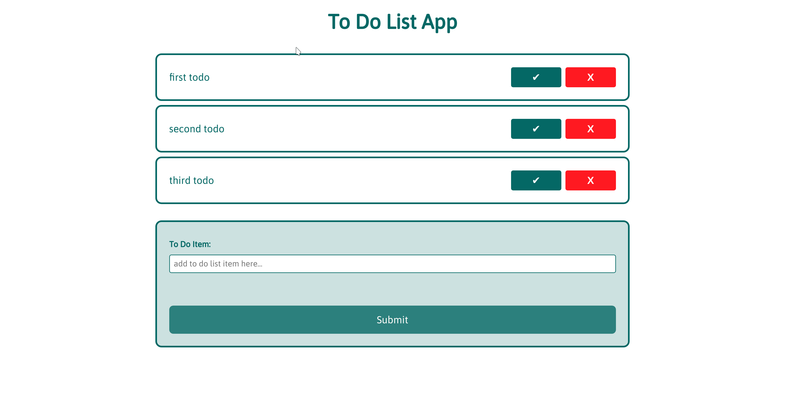

# To do list add for CC Team

link to [website!](https://fac-15.github.io/CC_toDoList/)

#### Installation
If you would like to clone and download the files to see locally, you can use the github clone or download button above. If so, please be sure to run `npm install` in order to download our dev dependencies.

##  Built With
- JavaScript
- HTML
- CSS
- Tape for testing

#### Lessons learned...:

- DeepEquals is needed to check inside an array or object.
- A key is needed to call an item in a object.
- Learn how to use array methods on objects (concat, filter and map).
- IIFE how it works
- How to use => function 
- How a spread operator works 
- How to use DOM manipulation
- Use ElementChild 

#### Issues we faced during this project:

- Understanding the code we started with
- Write proper test statements
- Using button to marktodo instead of checkbox
- Wrapping heads around the MVC setup (separation of logic and view) in this project

## Notes and stuff
- [IIFE - Immediately Invoked Function Expression](https://developer.mozilla.org/en-US/docs/Glossary/IIFE)
- Tested with tape

## Still todo on the todo...ironically...
- Add the sort function
- up our emoji game
- be more disciplined with testing (i.e. let it drive our development, rather than just getting on with it)

